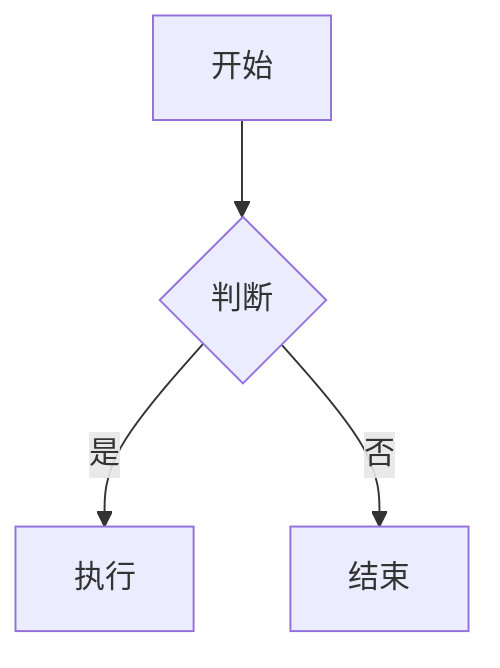

# Obsidian 笔记写作规范

所有生成的笔记必须遵循以下规范，确保与 Obsidian 完美兼容。

---

## 1. 文件命名

- 使用 **中文或英文**，避免特殊字符（`/ \ : * ? " < > |`）
- 使用 **短横线** `-` 连接多个词，不要用空格或下划线
- 文件名即笔记标题，保持简洁明了
- 示例：`react-hooks-最佳实践.md`、`typescript-generics.md`

---

## 2. Frontmatter（YAML 元数据）

每篇笔记**必须**在开头包含 YAML frontmatter：

```yaml
---
title: 笔记标题
date: 2026-06-26
tags:
  - tag1
  - tag2
category: 分类名称
status: draft | published | archived
aliases:
  - 别名1
  - 别名2
---
```

### 必填字段

| 字段 | 说明 | 示例 |
|------|------|------|
| `title` | 笔记标题 | `React Hooks 指南` |
| `date` | 创建日期 | `2026-06-26` |
| `tags` | 标签列表 | `['react', 'hooks']` |

### 可选字段

| 字段 | 说明 | 示例 |
|------|------|------|
| `category` | 分类 | `前端开发` |
| `status` | 状态 | `draft` / `published` / `archived` |
| `aliases` | 别名列表 | `['RHG', '钩子']` |
| `source` | 来源 | `https://example.com` |
| `author` | 作者 | `张三` |

---

## 3. 内部链接（Wiki Links）

### 基本语法

```markdown
[[笔记名称]]
[[笔记名称|显示文本]]
[[笔记名称#标题]]
```

### 使用场景

- **引用相关笔记**：`[[React 基础]]`
- **自定义显示文本**：`[[React 基础|上一篇]]`
- **链接到标题**：`[[React 基础#useEffect]]`

### 最佳实践

- 优先使用内部链接构建知识网络
- 在相关概念处添加链接
- 不要过度链接，保持可读性

---

## 4. 标签规范

### 标签格式

- 使用 `#标签名` 格式
- 多级标签用 `/` 分隔：`#前端/React/Hooks`
- 标签放在 frontmatter 的 `tags` 字段或内容中

### 标签命名

- 使用小写英文，避免中文标签（不利于检索）
- 保持简洁：`#react` 而非 `#react-hooks-最佳实践`
- 建立标签层级体系

### 推荐标签体系

```
#技术栈
  #前端 / #后端 / #数据库
#语言
  #javascript / #typescript / #python
#框架
  #react / #vue / #nodejs
#主题
  #算法 / #设计模式 / #架构
```

---

## 5. Callouts（标注块）

使用 Obsidian 原生 callout 语法：

```markdown
> [!note] 标题
> 内容

> [!tip] 提示
> 有用的小技巧

> [!warning] 警告
> 需要注意的问题

> [!info] 信息
> 补充说明

> [!question] 问题
> 需要思考的问题

> [!example] 示例
> 代码或示例

> [!quote] 引用
> 引用内容
```

### 常用类型

| 类型 | 用途 |
|------|------|
| `note` | 普通注释 |
| `tip` | 实用技巧 |
| `warning` | 警告信息 |
| `info` | 补充信息 |
| `question` | 待思考问题 |
| `example` | 示例说明 |
| `quote` | 引用内容 |
| `danger` | 危险操作 |
| `success` | 成功案例 |

---

## 6. 内容结构

### 标准结构

```markdown
---
title: xxx
date: 2026-06-26
tags: []
---

# 一级标题（笔记标题）

简短的引言或摘要（2-3 句话）

## 二级标题

### 三级标题

正文内容...

## 参考资料

- [链接描述](URL)
```

### 格式要求

- **标题层级**：最多使用 4 级标题（`#` ~ `####`）
- **段落间距**：段落之间空一行
- **列表**：使用 `-` 或 `1.`，保持缩进一致
- **代码块**：指定语言标识

---

## 7. 代码块

### 语法

````markdown
```language
代码内容
```
````

### 要求

- **必须指定语言**：`javascript`、`typescript`、`python` 等
- **保持缩进**：使用 2 或 4 空格，保持一致
- **添加注释**：关键代码添加行内注释

### 支持的语言标识

```
javascript / js / typescript / ts
python / py / java / go / rust
html / css / scss / json / yaml
bash / shell / sh / zsh
sql / graphql / docker
```

---

## 8. 图片和附件

### 路径规范

- 使用相对路径：`![[./images/example.png]]`
- 图片放在 `assets/` 或 `attachments/` 目录
- 使用 Obsidian 内部链接语法引用图片

### 图片语法

```markdown
![[图片名称]]
![[图片名称|宽度]]
![[./路径/图片名称]]
```

---

## 9. 表格

```markdown
| 列1 | 列2 | 列3 |
|-----|-----|-----|
| 数据 | 数据 | 数据 |
```

### 要求

- 保持对齐（可选，Obsidian 会自动渲染）
- 表头清晰描述列内容
- 避免过宽的表格（移动端体验差）

---

## 10. 数学公式（LaTeX）

### 行内公式

```markdown
$E = mc^2$
```

### 块级公式

```markdown
$$
\sum_{i=1}^{n} x_i
$$
```

---

## 11. Mermaid 图表

```markdown

```

---

## 12. 导出和兼容性

### 确保兼容

- 避免使用 Obsidian 独有的插件语法
- 内部链接保持 `[[]]` 格式，不要转换为 HTML
- 图片使用相对路径，便于迁移

### 常见问题

1. **链接失效**：确保 `[[笔记名]]` 中的名称与文件名完全一致
2. **图片不显示**：检查路径是否正确，使用相对路径
3. **格式错乱**：确保 frontmatter 格式正确，YAML 缩进使用空格

---

## 检查清单

生成笔记后，确认以下项目：

- [ ] 文件名符合命名规范
- [ ] 包含完整的 frontmatter
- [ ] 标签格式正确
- [ ] 内部链接语法正确
- [ ] 代码块指定了语言
- [ ] 图片路径使用相对路径
- [ ] 标题层级不超过 4 级
- [ ] 段落之间有空行
- [ ] Callout 语法正确
